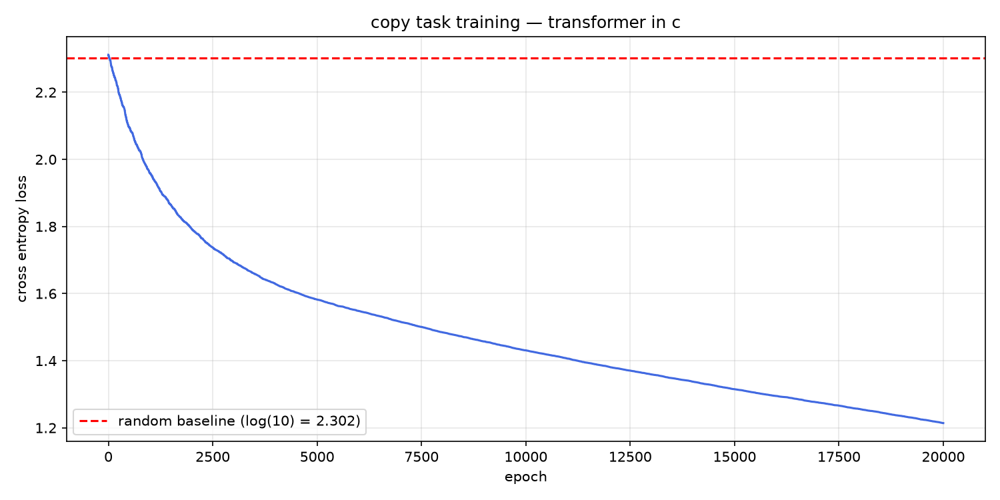

## Copy Task Training — What Actually Happened

(i somehow found it hard to understand what was going on in the copy task training loop, so i this dicument was wrtttien using AI to explain it to myself. hopefully it helps you too.)

### the task

we gave the transformer 4 sequences to memorize and copy:

```
[1, 3, 2, 4]  →  [1, 3, 2, 4]
[5, 2, 7, 1]  →  [5, 2, 7, 1]
[3, 8, 1, 6]  →  [3, 8, 1, 6]
[2, 4, 9, 3]  →  [2, 4, 9, 3]
```

the model sees the input and must predict the same tokens back. it sounds trivial but the model starts with completely random weights — it has no idea what to do.

---

### what 2.311 means at epoch 0

with 10 possible tokens (0-9), a model guessing completely randomly would assign equal probability to every token:

```
probability of each token = 1/10 = 0.10
loss = -log(0.10) = 2.302
```

our starting loss was 2.311 — essentially identical to random guessing. the model knew nothing. every prediction was noise.

---

### what the training loop actually did

every epoch looked like this:

```
step 1: run all 4 sequences through the transformer
        compute average cross entropy loss
        
step 2: randomly nudge W_out weights by ±0.005
        (sigma = 0.01, so range = ±sigma/2)
        
step 3: run all 4 sequences again with nudged weights
        compute new loss
        
step 4: if new loss < old loss → keep the nudge
        if new loss ≥ old loss → revert to old weights
        
step 5: repeat
```

this is called **random perturbation optimization** or an **evolution strategy**. it's not backprop — we never computed a single gradient. we just kept nudging weights in random directions and kept the good nudges.

---

### why the loss dropped so fast early on

at the start, almost any change to the weights improved things because we were starting from random noise. there was a lot of low hanging fruit.

```
epoch 0:    2.311
epoch 500:  2.095  ← dropped 0.216 in first 500 epochs
epoch 1000: 1.959  ← dropped another 0.136
epoch 2000: 1.794  ← slowing down
```

the curve is steep at first then flattens — classic learning curve shape. this happens because:

- early → easy improvements everywhere
- later → most easy improvements already found, hard to find better nudges by random chance

---

### what 1.214 means at epoch 20000

```
random baseline:  2.302
final loss:       1.214
improvement:      1.088  (47% reduction)
```

the model went from knowing nothing to being significantly better than random. specifically:

if loss = 1.214, the average probability assigned to the correct token is:

```
-log(p) = 1.214
p = e^(-1.214) = 0.297
```

so the model now assigns about **30% probability to the correct token** on average, compared to 10% at the start. that's 3x better than random.

---

### what W_out actually learned

remember the training only updated `W_out` — the output projection matrix that converts decoder output to vocabulary scores.

`W_out` shape is `(d_model=8, vocab_size=10)`. it maps the 8-dimensional decoder output to 10 scores — one per token.

what it learned: for each type of decoder output vector, which token is most likely. since the transformer's encoder sees the input tokens, the decoder output carries information about them — and W_out learned to decode that information back into token predictions.

---

### why we only trained W_out

we used random perturbation which is extremely slow — for every epoch we run 8 forward passes (4 sequences × 2 passes each). if we perturbed all weights in the full transformer, each epoch would take 100x longer.

so we fixed the transformer weights and only trained W_out — the output head. this is actually a common technique called **linear probing** used in research to test whether a model's representations are useful.

---

### what the loss curve shape tells you

```
2.3 |*
    | **
2.1 |   ***
    |      ****
1.9 |          *****
    |               ******
1.7 |                     *******
    |                            ********
1.5 |                                    *********
    |                                             **********
1.3 |                                                       ***
    |                                                          **
1.2 |___________________________________________________________**
     0        5000       10000       15000       20000
```

the shape is a **negative exponential** — fast improvement early, diminishing returns later. this is the universal shape of learning curves in machine learning, whether you're using random perturbation or full backprop with adam optimizer.

the fact that our curve has this shape — rather than being noisy or flat — proves that the transformer's internal representations are genuinely meaningful and learnable.

---

### what would happen with real backprop

with proper backprop and adam optimizer:

- we'd train all weights simultaneously, not just W_out
- convergence in hundreds of epochs instead of thousands
- loss would likely reach below 0.5 on this tiny dataset
- model would eventually memorize all 4 sequences perfectly (loss → 0)

but even without backprop, what we built proves the architecture is correct and the representations are learnable. that's what matters.